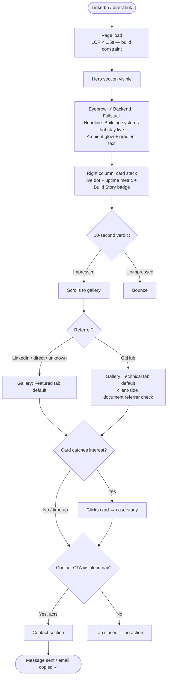
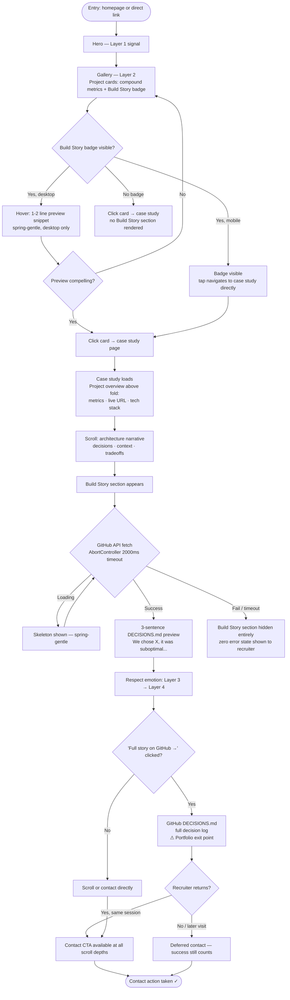
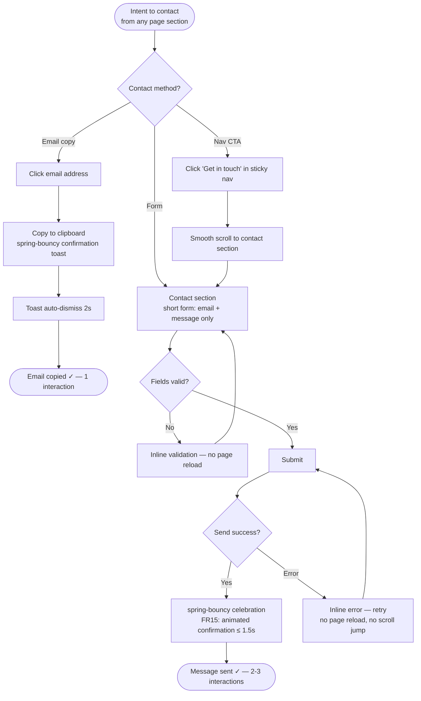
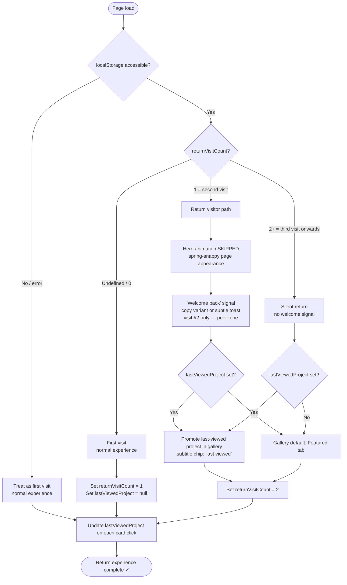

# UX Design Specification — portfolio-v2

**Author:** Chính
**Date:** 2026-03-01

---

## Executive Summary

### Project Vision

portfolio-v2 is an evidence-based developer portfolio system that replaces claim-driven portfolios
with verifiable proof: live production output, documented AI/human decision processes, and speed
signals. The core thesis is that technical recruiters cannot verify developer capability from
traditional portfolios — portfolio-v2 changes the medium from assertion to demonstration.
Design philosophy: authentic over polished.

### Target Users

Five distinct personas drive UX decisions:

- **Linh (Fast Scanner):** Technical recruiter with < 2 minutes. Needs immediate credibility
  signal. LCP < 1.5s is a design constraint, not a stretch goal.
- **Minh (Deep Explorer):** Senior recruiter conducting workflow audit. Wants to trace
  decision-making, not just see finished work.
- **David (Engineering Manager):** Evaluates technical depth and architecture judgment. Wants
  real code, real tradeoffs, real system design context.
- **Chính (Owner/Admin):** Portfolio owner managing content and monitoring via admin surface.
  Zero cold start requirement — system must be self-maintaining.
- **Thao (Demo App User):** Arrives via demo app backlink. Forms trust through quality of
  embedded experience, not portfolio content directly.

### Trust Architecture

UX is organized around a **trust escalation ladder** — each layer progressively reveals
deeper evidence for users who are ready to go deeper:

- **Layer 1 — Immediate signal:** Visual impact, key metrics, live project status
- **Layer 2 — Process evidence:** Case study summary, project card with context
- **Layer 3 — Technical depth:** Code snippets, architecture context, real tradeoffs
- **Layer 4 — Decision transparency:** AI Build Story (GitHub-native), full repo access

Fast scanners (Linh) are served by Layer 1. Deep explorers (David, Minh) self-select into
Layers 3–4. No forced path — progressive disclosure by intent.

### Key Design Challenges & Decisions

1. **Evidence over claims:** Information hierarchy organized by trust layers, not content type.
   Surface signals that deeper evidence exists (Layer 4 badge) without requiring deep-dive.

2. **Dual-speed flows (resolved):** Trust escalation ladder serves both < 2-min scanners and
   10+ min explorers from the same layout. No separate entry points needed.

3. **Dual-surface coherence:** Portfolio FE (public) and Admin (owner) are distinct surfaces
   with different interaction paradigms but shared visual identity. To be designed in later steps.

4. **Motion system (resolved):** Three spring physics tokens:
   - `spring-gentle` → hover, micro-interactions
   - `spring-snappy` → page transitions, modal open/close
   - `spring-bouncy` → celebrations (contact form success per FR15)
   Global `MOTION_ENABLED` flag driven by `prefers-reduced-motion`. Scroll reveals:
   opacity + translateY ≤ 20px, appear-on-entry only, no exit animation.

5. **Returning visitor experience FR17 (resolved):** localStorage-based, client-only.
   Three behaviors on return visit detection:
   ① Hero animation skipped
   ② Subtle "welcome back" signal (toast or copy variant)
   ③ Last-viewed project promoted in gallery

### AI Build Story Architecture (FR34)

**Model:** GitHub-native content. Build stories live in project repos (e.g., `DECISIONS.md`),
not in a CMS. Portfolio surfaces a 2–3 sentence preview snippet via GitHub API + link
"Full story on GitHub →" on each project card.

**Rationale:** Authentic placement (stories live where work happens), zero backend content
management overhead, consistent with platform philosophy of source-of-truth-in-code (FR51).

**MVP scope:** Yes. Requires Chính to author `DECISIONS.md` content per project before launch.
Empty state design required (no placeholder text visible to recruiters).

### Design Opportunities

1. **AI Build Story UI:** Preview card pattern surfaces decision transparency without leaving
   portfolio. GitHub link rewards depth-seekers. High differentiation, low complexity.
2. **Live system health signals:** WebSocket-powered real-time indicators (FR31) turn portfolio
   into living proof of production-readiness.
3. **Physics as brand signature:** Three-token spring system creates consistent emotional
   memory across all interactions.
4. **Admin-as-showcase:** Admin dashboard demonstrates system thinking — architecture visible
   through the UX of the management interface.

---

## Core User Experience

### Defining Experience

The core user action is the **10-second verdict**: a recruiter lands on the homepage,
receives a credibility signal, and decides whether to stay or leave. All UX decisions
are designed backward from this moment.

**Hero Model — Hybrid B+bio:**
- **Above fold:** Proof first — live projects, key metrics, stack signal. No identity
  intro, no "Hi I'm X" opener. Recruiter already knows they're looking at a developer.
- **Below fold:** POV bio — 3-4 sentences of engineering philosophy, not a CV summary.
  Not "3 years of React experience" but "why and how I build."
- Bio does not block proof. Proof is the first impression; bio is the context layer.

The portfolio does not guide users through a narrative journey. It presents evidence
immediately and rewards those who choose to go deeper.

### Platform Strategy

- **Platform:** Web, responsive (mobile-first, 320px → 4K)
- **Input:** Mouse + keyboard primary; touch supported
- **Browsers:** Chrome, Firefox, Safari, Edge — latest 2 versions
- **Offline:** Not required
- **Sharing:** Link sharing expected — og:image and meta title must communicate
  value proposition even before the page loads (social preview as Layer 0 trust signal)

### Effortless Interactions

The following interactions must require zero cognitive friction:

1. **Filter projects by tech stack** — one-click, instant, no page reload
2. **Read a case study uninterrupted** — no popups, no sticky elements competing
   for attention, no pagination breaking flow
3. **Contact** — email copy-to-clipboard + form submission in < 3 taps/clicks

The returning visitor experience (FR17) is effortless by design: detection is
automatic (localStorage), no prompt, no opt-in.

### Gallery Smart Default

Gallery default state driven by `document.referrer` — client-side, zero backend,
privacy-safe:

- **GitHub referrer** → default tab/filter: "Technical" (BE, systems, architecture projects)
- **Default (LinkedIn, direct, unknown)** → default tab/filter: "Featured" (manually curated)
- Maximum 2 variants. No additional referral-source branching.

**Launch gate:** Portfolio will not be released until all gallery projects have live URLs.
"Production-ready means a live URL, not a badge" — enforced at product level, not code level.

### Critical Success Moments

| Moment | Surface | Success Condition | Failure Mode |
|--------|---------|-------------------|--------------|
| **First 10 seconds** | Hero section | Recruiter sees proof of capability immediately | Generic intro copy, recruiter bounces |
| **First gallery scroll** | Project gallery | ≥1 project communicates relevance to recruiter's domain | No relevance signal, no click |
| **Case study entry** | Project card → detail | Card content earns the click | Visually polished but content-empty card |
| **Contact decision** | Contact section | Message sent or email copied in < 3 interactions | Friction kills intent |

### Experience Principles

1. **Trust in seconds, depth on demand** — Hero delivers full credibility signal in
   < 10 seconds. Deeper layers are always one click away but never interrupt the fast path.

2. **Show, don't tell** — Every claim is backed by a live artifact, metric, or linkable
   output. No adjectives without evidence. All gallery projects have live URLs at launch.

3. **Speed IS the message** — LCP < 1.5s is a design statement: a fast portfolio is
   proof of performance engineering. No video backgrounds, no heavy JS on load,
   no full-screen image carousels. Perceived speed (skeleton states) = measured speed.

4. **Gallery is the pivot** — Project gallery is the most critical surface. Card design,
   filter UX, smart defaults, and content strategy receive highest design priority.

---

## Desired Emotional Response

### Primary Emotional Goals

**Primary:** Confident — Recruiter leaves the portfolio with enough conviction
to take action: send a message, book a call, share the link with a hiring manager.
Confidence is the conversion emotion. All design decisions are evaluated against
this question: "Does this make the recruiter more or less confident?"

**Emotional escalation ladder** (mirrors trust architecture):
- Layer 1 → **Surprised** ("this portfolio is different")
- Layer 2 → **Curious** ("I want to see more of this")
- Layer 3 → **Respect** ("this person knows what they're doing")
- Layer 4 → **Confident** ("worth reaching out")

### Emotional Journey Mapping

| Stage | Surface | Target Emotion | Design Response |
|-------|---------|----------------|-----------------|
| **Discovery (0–10s)** | Hero section | Surprised | Proof-first layout; live signals subvert portfolio conventions |
| **Exploration** | Project gallery | Curious | Compound credibility signals on cards invite clicking |
| **Validation** | Case study / AI Build Story | Respect | Documented failure + learning earns more respect than polished success |
| **Decision** | Contact section | Confident | Zero friction, clear CTA, no second-guessing |
| **Return visit** | Homepage | Welcomed | Subtle adaptation, no announcement |

### Surprised: Positive Trigger, Not Absence Trigger

"Surprised" must be triggered by *seeing unexpected evidence*, not by *not finding
a bio*. If the hero makes recruiter think "wait, where's the about?" — that is a
design failure. If it makes them think "wait, this project is live and has uptime
metrics?" — that is a design win.

**Positive surprise triggers:**
- Live status pulse indicator on project cards (unexpected in a portfolio)
- Compound credibility metrics: `⚡ 14 days to ship` + `🟢 127 days uptime`
  — speed signal paired with stability signal. Neither alone is enough; together
  they preempt the "rushed?" skepticism.
- Tech stack displayed as versioned icons, not plain text — signals precision

### Micro-Emotions

| Emotion | Where | How |
|---------|-------|-----|
| **Surprised** | Hero, first 10s | Proof-first layout + live signals — unexpected, intentional |
| **Curious** | Gallery cards | Compound metrics, Build Story badge, live URL chip |
| **Respect** | Case study / decision log | Vulnerability IS the credential — failure documented openly |
| **Confident** | Contact section | Short form, email copy-to-clipboard, no CAPTCHA friction |
| **Welcomed** | Return visit | Animation skipped, last project surfaced — noticed but not announced |

**Micro-emotions to prevent:**

| Avoid | Trigger | Prevention |
|-------|---------|------------|
| **Overwhelmed** | Too much above fold | Trust ladder gates depth — Layer 1 is minimal |
| **Skeptical** | Marketing language | Zero adjectives without evidence; live URLs are primary CTAs |
| **Confused** | Missing expected bio | Bio exists below fold; hero signals are clear and intentional |
| **Bored** | Templated layout | Physics animations as brand texture; proof-first breaks convention |

### AI Build Story Emotional Design

**Content standard:** "We chose X, it was suboptimal, here's what we learned."
Full vulnerability, no softening. This is not a weakness — it is the credential.
Junior developers don't have this story because they haven't shipped real systems.

**Format:** Decision log — timestamp + decision + outcome + learning.
Familiar to technical readers (mirrors commit message conventions).
GitHub-native; portfolio surfaces 2-3 sentence preview only.

### Design Implications

- **Confident → Frictionless contact:** CTA visible at all trust layers.
  One-click email copy. Short form. No CAPTCHA. No required fields beyond
  email + message.

- **Surprised → Compound credibility signals:** Hero and project cards lead
  with paired metrics (speed + stability), live status indicators, versioned
  stack icons. Intentionality must be immediately legible — not "where's the bio?"
  but "wait, this has uptime data?"

- **Curious → Depth signals without depth commitment:** Cards signal that more
  exists without demanding it be read. Build Story badge, live URL chip, tech tags.

- **Respect → Documented failure as evidence:** Case studies and decision logs
  do not polish away suboptimal choices. "Chose MongoDB, hit schema evolution pain,
  migrated to PostgreSQL" is not a failure story — it is production experience proof.

- **Welcomed → Invisible adaptation:** Return visit detection has zero UI
  announcement. Experience adjusts silently.

### Emotional Design Principles

1. **Confident is the destination** — Every surface is evaluated: does this
   increase or decrease recruiter confidence? Navigation, copy, animation,
   load speed — all measured through this lens.

2. **Earn emotions, don't claim them** — Portfolio never describes itself as
   impressive or professional. It demonstrates and lets recruiter form their verdict.
   Self-description is skepticism fuel.

3. **Vulnerability IS the credential** — Documented failure earns more respect
   than curated success. Recruiter who reads "we chose wrong and here's what we
   learned" is reading evidence of real production experience.

4. **Motion carries emotion** — Each spring token chosen for emotional register:
   `spring-bouncy` = delight, `spring-gentle` = responsiveness signal,
   `spring-snappy` = confident navigation.

---

## UX Pattern Analysis & Inspiration

### Inspiring Products Analysis

#### Linear — Information Density & Speed-as-Design
**What it does well:** Zero decorative elements. Every pixel earns its place.
Navigation is instant; no loading states for common actions. Typography hierarchy
alone communicates importance — no color-coding, no icon overload.
**Relevance:** Portfolio-v2 "Speed IS the message" principle directly mirrors
Linear's philosophy. Information density over visual noise. Skeleton states over
spinners. Typography-first hierarchy for project cards.

#### Vercel Dashboard — Proof-First Data UI
**What it does well:** Landing screen IS the status dashboard — deployment health,
build times, domain status. No marketing copy above the fold. The product proves
its value through its own interface before any text explanation.
**Relevance:** Hero section model. Portfolio proves Chính's capability through
live data signals, not through claims. Compound metrics (build time + uptime)
mirror Vercel's deployment + function invocations pairing.

#### Raycast — Motion as Brand Identity
**What it does well:** Spring physics are consistent across every interaction —
search results, command palette, extensions. Motion has a vocabulary: snap for
navigation, bounce for confirmation, gentle for hover. `prefers-reduced-motion`
respected globally via single toggle.
**Relevance:** Direct template for portfolio-v2 three-token spring system.
`spring-gentle`, `spring-snappy`, `spring-bouncy` mirrors Raycast's motion
vocabulary. Global `MOTION_ENABLED` flag pattern borrowed directly.

#### GitHub Profile README — Vulnerability as Content
**What it does well:** Best GitHub profiles document thinking, not just output.
Commit histories, issue discussions, PR reviews — all visible. Technical community
respects visible decision trails more than curated project showcases.
**Relevance:** AI Build Story format. Decision log pattern (timestamp + decision
+ outcome + learning) mirrors how technical readers consume GitHub content.
"Chose X, it was suboptimal, here's what we learned" is native to this medium.

### Recruiter Workflow Context

Recruiters (Linh, Minh) operate primarily in **LinkedIn + ATS + email** workflow.
UX implications:
- **LinkedIn mental model:** Profile card → summary → experience. Portfolio must
  not fight this model — it extends it with evidence LinkedIn cannot provide.
- **Link-sharing context:** Portfolio URL shared via email or LinkedIn message.
  og:image + meta title are the first UX touchpoint before page load.
- **Tab context:** Recruiter likely has 5-10 tabs open. Portfolio must earn
  attention in < 10 seconds or the tab closes. Speed is table stakes.

### Transferable UX Patterns

#### Navigation Patterns
- **Single-page with anchor scroll** (Linear) — no routing overhead, instant
  section jumps, back button works predictably. Portfolio sections as anchors,
  not separate pages.
- **Sticky minimal nav** (Vercel) — logo + 2-3 links max. Contact CTA always
  visible. No hamburger menu on desktop.

#### Interaction Patterns
- **One-click filter** (Linear issue list) — filter chips above gallery, instant
  results, no "apply" button. State persists in URL for shareability.
- **Copy-to-clipboard with confirmation** (Vercel CLI commands) — email address
  as copy target, `spring-bouncy` confirmation toast, auto-dismiss in 2s.
- **Expandable depth** (Stripe docs sidebar) — content visible at card level,
  full case study behind click. No forced reading path.

#### Visual Patterns
- **Data as hero** (Vercel dashboard) — metrics above fold, not below. Numbers
  before narrative. Trust layer 1 is quantitative.
- **Status indicators** (Linear issue states) — colored dots with semantic meaning.
  Green pulse = live, gray = archived. No text label needed.
- **Versioned tech chips** (GitHub dependency graphs) — `React 18.3`, not `React`.
  Precision signals current knowledge.

### Anti-Patterns to Avoid

| Anti-Pattern | Why It Fails | Portfolio-v2 Approach |
|-------------|--------------|----------------------|
| **Skill bars** (HTML 90%, CSS 85%) | Meaningless, unverifiable, laughed at by technical recruiters | Replaced by live project evidence + versioned stack chips |
| **Full-screen hero video** | Destroys LCP, adds no information, feels like marketing | Static proof-first layout, physics animations instead |
| **"Hire Me" primary CTA** | Desperate framing, low confidence signal | "Get in touch" or email copy — peer-to-peer tone |
| **Infinite scroll gallery** | No structure, no filter, no relevance signal | Filtered gallery with smart defaults, finite curated set |
| **Wall-of-text case study** | Recruiter bounces before reaching insight | Progressive disclosure: card preview → detail on demand |
| **Testimonial section** | Unverifiable social proof, adds skepticism | Replaced by live URLs, uptime data, GitHub activity |
| **"Passionate developer" copy** | Marketing language, zero information content | POV bio: philosophy + approach, specific and owned |
| **Skill endorsement counts** | Gameable, not correlated with capability | GitHub commit history, shipped features, production metrics |

### Design Inspiration Strategy

**Adopt directly:**
- Linear's typography-first hierarchy for project cards and section headers
- Vercel's data-as-hero above-fold structure
- Raycast's three-token spring physics vocabulary + global motion flag
- GitHub's decision log format for AI Build Story content

**Adapt for portfolio context:**
- Vercel's deployment status → Project health + uptime indicator
- Linear's filter chips → Tech stack filter for gallery
- Stripe's progressive disclosure → Card preview → case study depth pattern
- GitHub README → DECISIONS.md format with portfolio preview card

**Avoid entirely:**
- Any pattern that requires marketing language to function
- Any interaction that adds loading time to above-fold content
- Any social proof mechanism that cannot be independently verified
- Any visual pattern that positions the portfolio as "one of many"

---

## Design System Foundation

### Design System Choice

**Tailwind CSS + shadcn/ui**

- **Tailwind CSS** — utility-first CSS framework, zero runtime overhead,
  generates only used classes at build time
- **shadcn/ui** — not a dependency; components are copied into the codebase
  as owned source code. Full control, full customizability, no version lock-in.
- **Framer Motion** — animation layer for spring physics system (FR47)
- **Lucide React** — icon set (used by shadcn/ui by default, consistent, tree-shakeable)

### Rationale for Selection

1. **Aesthetic alignment** — Linear, Vercel, and Raycast (all three primary
   inspiration sources) are built on Tailwind-based systems. The aesthetic
   we're targeting is native to this stack.

2. **shadcn/ui ownership model** — Components are installed into the project
   and owned by the developer. Accessibility (ARIA, keyboard nav) is built-in
   from day one. Customization is direct code editing, not theme overrides.
   Aligns with "authentic over polished" philosophy — code is readable and honest.

3. **Spring physics compatibility** — Framer Motion integrates with Tailwind
   and shadcn/ui components without conflict. Motion tokens (`spring-gentle`,
   `spring-snappy`, `spring-bouncy`) are defined once and applied via Framer
   Motion's `transition` prop across all components.

4. **Solo developer efficiency** — Tailwind eliminates context-switching between
   CSS files and JSX. shadcn/ui eliminates building accessible base components
   from scratch. Both free Chính to focus on product decisions, not CSS mechanics.

5. **Learning curve is the investment** — Tailwind unfamiliarity is a one-time
   cost. The utility-first mental model becomes productive within 1-2 weeks and
   pays dividends for the entire project lifetime.

### Implementation Approach

**Phase 1 — Foundation setup (Sprint 0):**
- Install Tailwind CSS + PostCSS pipeline via Vite
- Initialize shadcn/ui with CLI (`npx shadcn-ui@latest init`)
- Define CSS custom properties for design tokens (colors, spacing, radius)
- Configure `tailwind.config.ts` with portfolio-specific tokens

**Component strategy:**
- Install shadcn/ui components on-demand (only what's used)
- Priority components for MVP: Button, Card, Badge, Input, Textarea, Toast,
  Dialog, Separator, Skeleton
- Custom components (no shadcn equivalent): ProjectCard, BuildStoryPreview,
  StatusIndicator, FilterChip, MetricPair

**Motion layer:**
- Framer Motion installed alongside Tailwind — no conflict
- `MOTION_ENABLED` context reads `prefers-reduced-motion` at app root
- Spring tokens defined as named Framer Motion `transition` objects:
  ```ts
  export const springGentle  = { type: 'spring', stiffness: 300, damping: 30 }
  export const springSnappy  = { type: 'spring', stiffness: 400, damping: 25 }
  export const springBouncy  = { type: 'spring', stiffness: 200, damping: 15 }
  ```

### Customization Strategy

**Design tokens (CSS custom properties in `globals.css`):**
- Color system: HSL-based, dark/light mode via `[data-theme]` attribute
- Typography scale: 4 sizes (sm/base/lg/xl) mapped to Tailwind config
- Spacing: Tailwind defaults sufficient, no custom scale needed
- Border radius: single token `--radius` controls all component roundness

**Dark mode:**
- Portfolio defaults to dark (developer aesthetic, Linear/Vercel precedent)
- Light mode available but not prioritized for MVP
- `class` strategy (not `media`) for user control if added later

**shadcn/ui customization approach:**
- Override component styles via Tailwind utility classes at usage site
- Do not modify shadcn component source files — only override at composition layer
- Exception: ProjectCard, StatusIndicator — built from scratch, not shadcn base

---

## Defining Core Experience

### 2.1 Defining Experience

**"Recruiter discovers AI Build Story and realizes this portfolio is different."**

> *portfolio-v2's defining moment: "Read how this developer actually thinks,
> not just what they built."*

Every other design decision exists to either **lead to** or **support** this moment.
The hero earns attention. The gallery earns the click. The case study earns the
scroll. The AI Build Story earns the "I need to reach out to this person."

This is the interaction recruiters describe to colleagues: "I found a portfolio
where the developer wrote honestly about the time they chose the wrong architecture.
With timestamps. And what they learned."

### 2.2 User Mental Model

**Current recruiter experience (what they expect):**
- Portfolio = polished showcase of finished work
- Skills section = unverifiable self-assessment
- "About me" = marketing copy
- GitHub link = maybe real, maybe tutorial clones
- Contact = "let me file this away"

**Mental model shift (what portfolio-v2 delivers):**
- Portfolio = engineering evidence system
- Project card = credibility signal, not thumbnail
- Build Story = proof of judgment, not proof of completion
- GitHub link = primary artifact, not afterthought
- Contact = "I need to talk to this person"

**The shift happens in one sentence.** When recruiter reads
"We chose MongoDB for initial velocity, hit schema evolution pain
at scale, migrated to PostgreSQL in Sprint 3 — here's what the
migration taught us about data modeling assumptions" — the mental
model changes permanently.

**What makes existing solutions terrible:**
- LinkedIn endorsements: gameable, not correlated with capability
- GitHub stars: vanity metric, not decision quality signal
- Interview coding tests: adversarial, doesn't reflect production judgment
- References: slow, requires pre-existing relationship, not scalable

AI Build Story is the first portfolio pattern that answers the
question technical interviewers actually want to ask:
"How does this person think when things don't go as planned?"

### 2.3 Success Criteria

| Criterion | Signal | Measurable |
|-----------|--------|------------|
| Recruiter reads preview in full | Scroll depth past Build Story section | Yes (analytics) |
| Recruiter clicks "Full story on GitHub →" | GitHub link click event | Yes |
| Recruiter contacts after Build Story | Session path: case study → contact | Yes |
| Recruiter describes it to others | Word-of-mouth / direct traffic | Proxy metric |

**Failure signals:**
- Recruiter reaches case study page but does not scroll to Build Story section
  → Card content didn't earn deep engagement
- Recruiter sees Build Story section but doesn't read preview
  → Preview copy not compelling enough

### 2.4 Novel vs. Established Patterns

**Novel (requires awareness, not education):**
- Decision log format in portfolio context — no established mental model.
  Mitigation: format mirrors commit message conventions (familiar to technical
  readers). Section label "Build Story" is accessible; "Decision Log" is not.

**Established (leverage existing mental model):**
- Card → detail progressive disclosure — recruiter already knows "click for more"
- GitHub link as artifact — technical community already navigates to repos
- Preview snippet → full content — Medium-style reading pattern

**The combination:** Familiar progressive disclosure carries recruiter into
novel content format. No user education required — they click because they
recognize the pattern, then encounter content they've never seen in a portfolio.

### 2.5 Experience Mechanics

**Build Story discovery flow:**

```
1. INITIATION
   Project card in gallery
   → Build Story badge: always-visible chip on card (not hover-triggered)
   → Desktop: hover reveals 1-2 line preview snippet (spring-gentle, enhancement only)
   → Mobile/touch: no hover — badge visible, tap navigates to case study directly
   → Click/tap: navigate to case study page

2. INTERACTION
   Case study page loads
   → Project overview (metrics, live URL, tech stack) — above fold
   → Scroll: case study narrative — architecture decisions, context
   → Scroll: "Build Story" section appears
   → GitHub API pre-fetched on page load; skeleton shown while loading
   → 3-sentence preview from DECISIONS.md rendered with spring-gentle appear
   → "Full story on GitHub →" link

3. FEEDBACK
   Content is honest, specific, unexpected
   → "We chose X, it was suboptimal, here's what we learned"
   → Respect emotion activated (Layer 3 → Layer 4 transition)

4. COMPLETION
   Recruiter reaches Layer 4
   → Clicks "Full story on GitHub →" OR scrolls back to contact
   → Confident emotion: "this person is worth a conversation"
   → Contact CTA available at all scroll depths
```

**API resilience:**
- Pre-fetch on case study page load (not lazy — avoids visible loading gap)
- Skeleton shown during fetch (spring-gentle fade-in on content arrival)
- On API failure or timeout > 2s → Build Story section hidden entirely
- Zero error state shown to recruiter. Absence is invisible.

**Badge inconsistency policy:**
- Some project cards have Build Story badge; some do not — intentional and acceptable
- Badge presence = "this project has a decision story written"
- Badge absence = honest: story not yet authored, not hidden or faked
- `hasBuildStory` boolean flag in project data drives conditional render
- No placeholder, no "coming soon" — absence is silence, not apology

---

## Visual Design Foundation

### Color System

**Primary Accent — Electric Purple**

Base token: `#A855F7` (purple-500). Full shade scale:

| Token | Hex | Usage |
|-------|-----|-------|
| `purple-50` | `#FAF5FF` | Light bg tints (light mode) |
| `purple-100` | `#F3E8FF` | Subtle accent bg (light mode) |
| `purple-200` | `#E9D5FF` | Accent borders (light mode) |
| `purple-300` | `#D8B4FE` | Text on dark, light-mode badges |
| `purple-400` | `#C084FC` | Icon accents, hover states |
| `purple-500` | `#A855F7` | **Primary accent — buttons, active states** |
| `purple-600` | `#9333EA` | Button hover, text on light bg |
| `purple-700` | `#7E22CE` | Deep accents |
| `purple-800` | `#6B21A8` | Dark accent backgrounds |
| `purple-900` | `#581C87` | Deepest accent |
| `purple-950` | `#3B0764` | Accent-tinted dark surfaces |

**Glow system:** `box-shadow: 0 0 28px rgba(168, 85, 247, 0.25)` applied to cards carrying
live metrics, project cards on hover, and Build Story preview elements. CSS-only — zero
performance cost.

**Background layers (dark mode — subtle purple tint):**

| Token | Hex | Usage |
|-------|-----|-------|
| `bg-base` | `#09090B` | Page background |
| `bg-subtle` | `#0F0F15` | Alternating sections |
| `bg-surface` | `#111118` | Cards, panels |
| `bg-elevated` | `#18181F` | Hover states, inputs |
| `bg-overlay` | `#1E1E28` | Modals, dropdowns |

**Text hierarchy (dark mode):**

| Token | Hex | Usage |
|-------|-----|-------|
| `text-primary` | `#FAFAFA` | Headings, key metrics |
| `text-secondary` | `#A1A1AA` | Body text, descriptions |
| `text-muted` | `#71717A` | Timestamps, metadata |

**Light mode:** bg-base `#FAFAF8`, surface `#FFFFFF`, text-primary `#09090B`,
text-secondary `#52525B`. Accent shifts to `purple-600` (`#9333EA`) for sufficient
contrast on light backgrounds. Glow radius reduced to `14px`.

**Semantic colors (shared):**

| | Hex |
|--|-----|
| Live / Success | `#22C55E` |
| Warning | `#F59E0B` |
| Error / Offline | `#EF4444` |

### Typography System

**Font:** Geist (Vercel) — geometric sans-serif, developer-native. Loaded via
`@vercel/font` or self-hosted. Geist Mono for all code, stack chips, and version numbers.

**Type scale:**

| Level | Size | Weight | Tracking | Usage |
|-------|------|--------|----------|-------|
| Display | `clamp(36px, 6vw, 64px)` | 800 | -0.045em | Hero headline (responsive) |
| H1 | 40px | 800 | -0.03em | Section titles |
| H2 | 28px | 700 | -0.02em | Card headings |
| H3 | 20px | 600 | -0.01em | Sub-headings |
| Body | 16px | 400 | 0 | Descriptions, body |
| Small | 13px | 500 | 0 | Meta, timestamps |
| Micro | 11px | 600 | +0.02em | Badges, labels (caps) |
| Mono | 13px | 500 | 0 | Code, stack chips |

**Rationale:** Negative letter-spacing on large sizes creates the tight, premium feel
characteristic of Linear and Vercel. Geist is designed for high legibility at small
sizes — critical for metadata-heavy project cards.

### Spacing & Layout Foundation

**Base unit:** 8px. All spacing values are multiples of 8.

**Layout feel:** Spacious — generous vertical rhythm, content breathes between sections.
Density is reserved for data-rich elements (metric chips, stack tags) where information
should feel compact by contrast.

**Page structure:**

| Breakpoint | Max-width | Horizontal padding |
|------------|-----------|-------------------|
| Mobile (320px+) | 100% | 20px |
| Tablet (768px+) | 100% | 40px |
| Desktop (1024px+) | 1200px | 64px |

**Section rhythm:**

| Context | Value |
|---------|-------|
| Section-to-section gap | 96px (desktop), 64px (mobile) |
| Card internal padding | 28px |
| Card gap in grid | 20px |
| Component vertical gap | 16px |
| Inline element gap | 8px |

**Grid:** 12-column, `gap: 20px`. Gallery defaults to 3-column desktop →
2-column tablet → 1-column mobile.

### Accessibility Considerations

- **Contrast:** `#FAFAFA` on `#09090B` = 19.6:1 (AAA). `#A855F7` used for
  decorative/accent only — never as sole carrier of text information.
- **Focus rings:** 2px solid `purple-400` (`#C084FC`) with 2px offset — visible
  against both dark and light surfaces.
- **Motion:** `MOTION_ENABLED` context reads `prefers-reduced-motion` at app root.
  All Framer Motion spring animations wrapped in conditional. Static fallback:
  instant state change, no transition.
- **Font size floor:** 11px minimum (Micro level). No content below 11px.
- **Color-blind safe:** Purple accent distinguishable from green semantic (`#22C55E`)
  across all common color vision deficiencies. Semantic states never rely on color
  alone — always paired with icon or text label.

---

## Design Direction Decision

### Design Directions Explored

Six layout directions were explored against the established visual foundation (Electric Purple,
Geist, spacious, dark-first), all using real portfolio content and component tokens:

| # | Direction | Core Concept |
|---|-----------|--------------|
| 1 | Data First | Live metrics dashboard as hero — numbers above headline |
| 2 | Typography Lead | Large display type full-width, proof stats in row below |
| 3 | Gallery Above Fold | Project grid immediately visible, no scroll required |
| 4 | Glow Dark | Ambient purple glow, 2-column layout, card stack on right |
| 5 | Editorial | Asymmetric layout, featured project prominent on right |
| 6 | Bento Grid | All signals above fold in varied-size grid cells |

### Chosen Direction

**Direction 04 — Glow Dark** with typography scale modification from Direction 02,
refined through multi-agent party mode review (Sally/UX, John/PM, Winston/Architect).

**Specific combination:**
- Direction 04 layout: 2-column split (hero copy left, project card stack right)
- Direction 04 aesthetic: ambient radial glow background, gradient headline text,
  purple-border cards with glow
- Direction 02 modification: hero headline scaled to `clamp(36px, 6vw, 64px)` —
  responsive, strong typographic impact without fixed breakpoint overrides

**Party mode refinements (accepted):**
1. **Copy:** Hero headline uses proof-oriented language — *"Building systems that stay live."*
   No performance claims. Language demonstrates, does not assert.
2. **Eyebrow:** `"⚡ Backend · Fullstack"` — role identity only. Proof signals live in
   card stack (right column), not duplicated in eyebrow.
3. **Technical:** `clamp(36px, 6vw, 64px)` for responsive heading. `color: purple-600`
   fallback for gradient text on light mode (gradient text unreadable on light backgrounds).
   Mobile: 2-column collapses to single column, card stack moves below hero copy.

### Design Rationale

**Why Glow Dark:**
The ambient glow creates immediate visual atmosphere aligned with "Surprised" as the first
emotional trigger (Layer 1 of trust escalation ladder). The deep dark background (`#050508`)
maximizes glow visibility and creates the premium, confident feel established in emotional
design goals. The 2-column layout solves the proof-visibility requirement: recruiter sees
both the identity/headline and live project evidence on the same fold — no scroll required
for either signal.

**Why the typography modification:**
At `clamp(36px, 6vw, 64px)` the headline creates strong typographic contrast against the
card stack on the right, reinforcing the hierarchy: statement first, evidence second, both
above fold. Responsive clamp eliminates mobile overflow risk and scales naturally.

**Why not other directions:**
- D1 (Data First): Metrics-only hero risks feeling cold — recruiter may miss the POV context
- D2 (Typography Lead): Full-width headline pushes proof cards below fold
- D3 (Gallery Above Fold): Identity/POV fully below fold — trades completeness for speed
- D5 (Editorial): Featured-project-as-focal-point reduces flexibility as content evolves
- D6 (Bento Grid): Highest information density but curation complexity risk as content changes

### Implementation Approach

**Hero section structure:**

```
[nav: logo | links | contact CTA]
  nav border: rgba(168,85,247,.1)

[hero background: #050508]
  ambient glow top-right: radial-gradient(circle, rgba(168,85,247,.12), transparent 70%)
  ambient glow bottom-left: radial-gradient(circle, rgba(168,85,247,.07), transparent 70%)

[hero — 2 column, 1.2fr : 1fr, gap: 48px]
  left:
    eyebrow chip: "⚡ Backend · Fullstack"
      style: purple-border pill, purple-300 text
    display heading: clamp(36px, 6vw, 64px), weight 800, tracking -0.045em
      gradient text on key phrase: linear-gradient(135deg, #C084FC, #D8B4FE)
      light mode fallback: color: #9333EA (purple-600)
    subtitle: 13px, text-secondary, max 2 lines, max-width: 380px
    CTA row:
      primary: "See the evidence" — purple-500 bg, glow box-shadow
      secondary: "Get in touch" — ghost, rgba(255,255,255,.06) bg

  right:
    stacked project mini-cards (2-3 visible)
    each card: purple glow border, live status dot, metrics chips, Build Story badge
    overflow hint: bottom fade suggesting more cards below

[mobile < 768px: single column, card stack below hero copy]
```

**Key visual tokens:**
- Hero bg: `#050508` (deeper than `bg-base` to maximize glow contrast)
- Ambient glow: `radial-gradient` with `pointer-events: none`, no JS
- Headline gradient: `linear-gradient(135deg, #C084FC, #D8B4FE)` on key phrase
- Card glow default: `0 0 18px rgba(168,85,247,.1)`
- Card glow hover: `0 0 28px rgba(168,85,247,.25)`
- Nav separator: `border-bottom: 1px solid rgba(168,85,247,.1)`

---

## User Journey Flows

### Journey 1: Fast Scanner (Linh — < 2 minutes)

**Entry:** LinkedIn message / direct link → cold open
**Critical success:** Credibility signal visible within 10 seconds → recruiter stays.

> **Build constraint (not runtime decision):** LCP < 1.5s is a non-negotiable
> performance budget enforced at build time, not a user-facing decision point.



**Flow optimizations:**
- `og:image` + meta title = Layer 0 trust signal before page loads
- Skeleton states during load → perceived speed matches LCP target
- Gallery smart default driven by `document.referrer` — client-side, zero backend
- Contact CTA sticky in nav — visible at every scroll depth

---

### Journey 2: Deep Explorer → Build Story (Minh / David)

**Entry:** Direct link or gallery click after initial scan
**Critical success:** Recruiter reads Build Story → mental model shifts → contacts.

> **Note:** Clicking "Full story on GitHub →" is a portfolio exit point. Recruiter
> may contact after returning, or via a bookmarked URL later. Deferred contact
> still counts as success.



**Flow optimizations:**
- GitHub API pre-fetched on case study page load — not lazy — prevents visible loading gap
- `AbortController` 2000ms timeout ensures fail-fast, not browser-default 30s+
- Contact CTA sticky — David does not need to scroll back to nav to contact

---

### Journey 3: Contact (from any trust layer)

**Entry:** Any section where recruiter decides to act
**Critical success:** Message sent or email copied in < 3 interactions.



**Flow optimizations:**
- No CAPTCHA — friction eliminated at the conversion moment
- No required fields beyond email + message — minimum viable contact
- Email copy-to-clipboard always available as 1-click fallback
- `spring-bouncy` on success = delight at completion (FR15)

---

### Journey 4: Return Visitor (silent adaptation)

**Entry:** Second+ visit, same browser
**Critical success:** Experience adapts invisibly — recruiter feels welcomed, not tracked.

> **Implementation note:** All localStorage access wrapped in `try/catch`.
> Private browsing or disabled storage → treat as first visit. No broken
> experience, no error, just skip the adaptation silently.



**Flow optimizations:**
- "Welcome back" signal only on **visit #2** — third visit+ is silent. Over-welcoming is friction.
- Animation skip is the primary welcome signal — faster page = felt, not explained
- `lastViewedProject` updated on every card click, persists across sessions
- All localStorage — no backend, no cookies, no GDPR surface

---

### Journey Patterns

**Navigation patterns:**
- Single-page anchor scroll — all sections reachable without routing overhead
- Sticky nav with Contact CTA — exit intent captured at every scroll depth
- Back button works predictably — no SPA routing surprises for case study navigation

**Feedback patterns:**
- `spring-bouncy` = completion / celebration (clipboard copy, form submit)
- `spring-gentle` = content appearing (Build Story skeleton fade, scroll reveals)
- `spring-snappy` = navigation (scroll to section, modal open/close)
- Toast auto-dismiss 2s — confirms action, disappears without requiring dismissal

**Error handling patterns:**
- API failure → silent omission (Build Story section hidden, not errored)
- Form error → inline, no page reload, no scroll jump
- API timeout → `AbortController` 2000ms, fail-fast, section hides gracefully
- localStorage error → `try/catch`, fallback to first-visit experience

### Flow Optimization Principles

1. **Zero scroll required for Layer 1** — hero + proof signals both above fold (2-column)
2. **Progressive disclosure gates depth** — recruiter self-selects into deeper layers, never forced
3. **Contact reachable from any depth** — sticky nav CTA eliminates "where do I contact?" friction
4. **Errors are invisible when possible** — API failures hide sections, never show error states
5. **Return recognition is behavioral, not announced** — faster page + promoted content = welcome
6. **Exit points are acknowledged** — GitHub link is a portfolio exit; deferred contact is success
7. **Smart defaults require zero interaction** — referrer-based gallery tab, return visit adaptation

---

## Component Strategy

### Design System Components

**Foundation: Tailwind CSS + shadcn/ui + Framer Motion**

portfolio-v2 builds on Tailwind CSS as the utility layer, shadcn/ui for accessible primitives, and Framer Motion for spring-physics animation. This stack provides the component foundation without enforcing rigid structure — every component can be styled to the Electric Purple / Glow Dark design direction.

**Available from shadcn/ui (used as-is or lightly wrapped):**

| Component | Usage in portfolio-v2 |
|---|---|
| `Button` | Hero CTA ("View My Work"), Contact form submit, Filter reset |
| `Badge` | Tech stack tags on ProjectCard |
| `Card` | Base container for ProjectCard and BuildStoryPreview |
| `Dialog` | Project deep-dive modal (future phase) |
| `Skeleton` | BuildStoryPreview loading state |
| `Toast` | Copy-to-clipboard confirmation, form submit feedback |
| `NavigationMenu` | Desktop sticky nav |
| `Sheet` | Mobile nav drawer |
| `Separator` | Section dividers |
| `Input` / `Textarea` | Contact form fields |
| `Label` | Form field labels |

**Available from Framer Motion (used directly):**

- `motion.div` — all animated containers
- `AnimatePresence` — exit animations (gallery filter transitions, skeleton swap)
- `useInView` — scroll-triggered reveals (project cards entering viewport)
- `useSpring` / `spring` transition type — spring physics tokens

---

### Custom Components

Custom components fill the gaps not covered by shadcn/ui primitives. All custom components consume design tokens (Electric Purple, glow system, type scale) and use `useMotion()` hook for animation toggling — never prop drilling.

**Folder structure (party mode refinement):**

```
src/components/portfolio/
├── primitives/          # Single-responsibility display atoms
│   ├── StatusIndicator.tsx
│   ├── EyebrowChip.tsx
│   └── MetricPair.tsx
└── composed/            # Multi-primitive compositions with logic
    ├── ProjectCard.tsx
    ├── BuildStoryPreview.tsx
    ├── FilterChip.tsx
    └── HeroCardStack.tsx
```

---

#### ProjectCard

**Purpose:** Display a single project with proof signals (metrics, status, tech stack) and entry point to deeper exploration.

**Usage:** Gallery section, rendered in responsive grid (1-col mobile → 2-col tablet → 3-col desktop).

**Anatomy:**
- Header: Project title + `StatusIndicator` badge
- Body: 2-line description (truncated)
- Metrics row: `MetricPair` components (ship days, uptime days)
- Footer: Tech stack `Badge` tags + "View Build Story" link
- Glow border: `box-shadow: 0 0 28px rgba(168,85,247,.25)` on hover

**States:**
- Default: Subtle border, no glow
- Hover: Purple glow activates, slight lift (`translateY(-2px)`)
- Loading: Full card skeleton via `Skeleton` components
- Filtered out: `opacity: 0` + `scale(0.95)` exit animation via `AnimatePresence`

**Variants:**
- `size="default"` — standard grid card
- `size="featured"` — wider card (spans 2 columns) for hero project

**Props:**
```typescript
interface ProjectCardProps {
  title: string
  description: string
  status: 'live' | 'building' | 'archived'
  metrics?: { shipDays?: number; uptimeDays?: number }   // typed (party mode)
  techStack: string[]
  buildStoryUrl?: string
  featured?: boolean
}
```

**Accessibility:** `role="article"`, `aria-label={title}`, keyboard-focusable, glow via CSS not content.

**Content guidelines:** Description ≤ 80 chars. Tech stack ≤ 5 tags visible (overflow hidden). Metrics shown only if value exists — no "0 days" displayed.

**Interaction behavior:** Full card is clickable (not just button). Click → scroll to Build Story or open deep-dive. Hover glow is `transition: box-shadow 200ms ease`.

---

#### StatusIndicator

**Purpose:** Communicate project life status as a visual signal — recruiter reads it in < 1 second.

**Usage:** Inside ProjectCard header. Used standalone in hero section.

**Anatomy:**
- Colored dot (8px circle, CSS animation for 'live')
- Status label text

**States / Variants:**
- `live` — green dot with CSS pulse animation (`@keyframes pulse`), label "Live"
- `building` — amber dot static, label "Building"
- `archived` — muted gray dot, label "Archived"

**Accessibility:** `aria-label="Project status: live"`, color is never the sole indicator (label always present).

---

#### BuildStoryPreview

**Purpose:** Surface the DECISIONS.md 3-sentence preview directly from GitHub API, making the build process tangible without leaving the portfolio.

**Usage:** Inside project detail area or as a card section below ProjectCard.

**Anatomy:**
- Section header: "Build Story" + GitHub icon link
- Loading state: 3 `Skeleton` lines (same height as text)
- Content: 3-sentence preview text (fetched via GitHub API)
- Footer: "Read full story on GitHub →" link

**States:**
- Loading: Skeleton lines visible
- Loaded: Fade-in text (`spring-gentle` transition)
- Error / timeout: Section hidden entirely (silent omission, `AbortController` 2000ms)

**Behavior:**
- Fetch triggered on component mount (not on hover)
- `AbortController` with 2000ms timeout — fail fast, never block paint
- Failure → `display: none` (not error message)

**Accessibility:** `aria-live="polite"` on content container (screen reader announces when loaded).

---

#### MetricPair

**Purpose:** Display a single metric with label in a visually tight format — part of ProjectCard proof signals.

**Usage:** Inside ProjectCard metrics row, 2 instances per card.

**Anatomy:**
- Number (bold, large): `font-variant-numeric: tabular-nums`
- Unit/label (small, muted): "days to ship", "days uptime"

**States:**
- Default: Static display
- Not available: Component not rendered (no empty state)

**Content guidelines:** Numbers only — no formatting frills. "47" not "47.0". Omit if metric unavailable.

---

#### FilterChip

**Purpose:** Allow gallery filtering by tech stack or project type with URL state persistence — shareable filtered views.

**Usage:** Gallery filter bar, rendered as a horizontal chip group.

**Anatomy:**
- Label text (e.g., "React", "TypeScript", "All")
- Active state: Purple background + white text
- Inactive state: Ghost border + muted text

**States:**
- Default (unselected): Ghost style
- Active (selected): Filled Electric Purple
- Hover: Subtle purple tint background
- Disabled: Not used (all filters always available)

**Behavior:**
- Click → update `activeFilter` state + `history.pushState()` URL update (no React Router)
- URL format: `/?filter=react` (shareable link)
- "All" chip always visible; clears filter
- Filter change → `AnimatePresence` exit/enter on ProjectCard grid

**Accessibility:** `role="group"` on container, each chip is `<button>` with `aria-pressed` state.

---

#### EyebrowChip

**Purpose:** Display role identity label above hero heading — quick visual anchoring for "who is this person."

**Usage:** Hero section, above H1 display headline.

**Anatomy:**
- Small pill: border + text
- Optional dot prefix (optional variant)

**Variants:**
- `variant="role"` — "Backend · Fullstack" (default, hero usage)
- `variant="tag"` — generic label usage elsewhere

**Content guidelines:** ≤ 4 words. No sentence case — use title or abbreviation format (e.g., "Backend · Fullstack", not "Backend and Fullstack developer").

---

#### HeroCardStack (party mode addition — Sally)

**Purpose:** Visual proof cluster in hero section right column — stacked card motif showing 3 live metrics at a glance, communicating active output without scrolling.

**Usage:** Hero section, right column (2-column hero layout). Replaces generic "stats block."

**Anatomy:**
```
┌─────────────────────────┐
│  ● Live                  │  ← StatusIndicator
│  3 projects shipped       │  ← Primary metric
│  47-day avg. time to ship │  ← Secondary metric
│  99.9% uptime (30d)      │  ← Tertiary metric
└─────────────────────────┘
   [Latest: portfolio-v2]    ← Most recent project name
```

**States:**
- Default: Static display with glow border
- Hover: Glow intensifies (matches ProjectCard hover)
- Loading: Skeleton for dynamic metric values

**Behavior:**
- Metric values sourced from static data (no API, avoids async delay above fold)
- "Latest" project name links to ProjectCard in gallery (smooth scroll)

**Accessibility:** `role="region"` with `aria-label="Portfolio overview"`. All metrics have `aria-label` context.

---

### Gallery Empty State (party mode addition — Sally)

When all projects are filtered out (no matches for active FilterChip):

```
                [Gallery area]

        No projects match this filter.

              Reset filter →

```

**Tone:** Direct, no apology. "No projects match this filter." — not "Sorry, nothing here yet!" or "Oops!"

**Action:** "Reset filter →" link clears active filter, returns to "All" view.

**Animation:** Empty state fades in via `spring-gentle` after `AnimatePresence` exit of last card.

---

### Component Implementation Strategy

**Design token consumption:**
- All custom components import from `src/styles/tokens.ts` (colors, spacing, animation)
- Electric Purple accent: `--color-accent: #A855F7`
- Glow system: CSS custom property `--glow-accent: 0 0 28px rgba(168,85,247,.25)`
- No hardcoded hex values in component files

**Motion architecture (`useMotion` hook — party mode refinement):**
```typescript
// src/hooks/useMotion.ts
const MotionContext = createContext({ enabled: true })
export const useMotion = () => useContext(MotionContext)

// Usage in component (never prop drilling)
const { enabled } = useMotion()
const transition = enabled ? { type: 'spring', ...springSnappy } : { duration: 0 }
```

**shadcn/ui extension pattern:**
- Wrap shadcn primitives, never fork
- Custom variants via `class-variance-authority` (CVA) — matches shadcn's own pattern
- Example: `Button` extended with `variant="glow"` for hero CTA

**Accessibility baseline:**
- All interactive components keyboard-navigable (Tab + Enter/Space)
- Color contrast ≥ 4.5:1 for all text (AA standard minimum)
- Motion respects `prefers-reduced-motion` via `MOTION_ENABLED` context
- ARIA labels on all icon-only buttons and status indicators

---

### Implementation Roadmap

**Phase 1 — Core Components (required for above-fold experience):**

| Component | Needed for |
|---|---|
| `EyebrowChip` | Hero section renders |
| `HeroCardStack` | Hero right column, immediate trust signal |
| `StatusIndicator` | Used inside HeroCardStack and ProjectCard |
| `ProjectCard` | Gallery renders (critical user journey) |
| `FilterChip` | Gallery filtering (Journey 2: Technical Evaluation) |

**Phase 2 — Supporting Components (complete gallery experience):**

| Component | Needed for |
|---|---|
| `BuildStoryPreview` | Project depth layer, Build Story journey |
| `MetricPair` | ProjectCard proof signals complete |
| Gallery empty state | FilterChip workflow completeness |

**Phase 3 — Enhancement Components (polish and delight):**

| Component | Needed for |
|---|---|
| `HeroCardStack` animation polish | Scroll-triggered counter animation on metrics |
| `ProjectCard` featured variant | Hero project above standard grid |
| `BuildStoryPreview` skeleton refinement | Loading experience quality |

This roadmap prioritizes above-fold trust signals first — a recruiter arriving at the page sees a complete, professional experience before any Phase 2 or 3 work is done.

---

## UX Consistency Patterns

### Button Hierarchy

portfolio-v2 uses a 3-level button hierarchy. Each level communicates urgency and importance.

**Level 1 — Primary CTA (Electric Purple, filled):**
- **When:** Single dominant action per section — "View My Work" (hero), "Send Message" (contact form)
- **Visual:** `bg-purple-500 text-white` + glow effect on hover (`box-shadow: 0 0 28px rgba(168,85,247,.25)`)
- **Rule:** Maximum one Primary CTA visible at a time. Never two filled-purple buttons in the same viewport section.
- **Accessibility:** `role="button"`, explicit `aria-label` if icon-only

**Level 2 — Secondary Action (Ghost, purple border):**
- **When:** Supporting actions alongside Primary — "Download CV", "View on GitHub"
- **Visual:** Transparent background + `border: 1px solid rgba(168,85,247,.5)` + purple text
- **Rule:** Can coexist with Primary CTA. Hover → subtle purple background tint (`rgba(168,85,247,.08)`)

**Level 3 — Ghost Action (text-only or minimal border):**
- **When:** Tertiary navigation, filter reset, "Read full story →" links
- **Visual:** Muted text + no background. Underline or arrow `→` on hover.
- **Rule:** Used for non-critical paths. Never competes visually with Level 1 or 2.

**Button sizing:**
- Default: `h-10 px-4` (standard shadcn)
- Large: `h-12 px-6` — hero CTA only
- Small: `h-8 px-3` — FilterChip, inline actions

**Disabled state:** `opacity: 0.4`, `cursor: not-allowed`. Never hide disabled buttons — keep visible as feedback that action exists but isn't available.

---

### Feedback Patterns

**Toast notifications (action confirmation):**
- **Trigger:** Copy to clipboard (email, GitHub URL), contact form submit success
- **Visual:** Bottom-right, dark background `#1E1E28` + Electric Purple left border (4px)
- **Duration:** Auto-dismiss 2000ms. No manual dismiss required.
- **Position:** Does not overlap with sticky nav or active content
- **Message style:** Action-confirming, concise. "Email copied." not "Your email address has been copied to your clipboard successfully!"
- **Accessibility:** `role="status"`, `aria-live="polite"`

**API loading states:**
- **BuildStoryPreview:** Skeleton lines (same height as loaded text) visible immediately on mount
- **Transition:** Skeleton → content via `spring-gentle` fade (200ms)
- **Rule:** Skeleton always matches content dimensions — no layout shift on load

**API failure — silent omission pattern:**
- **When:** GitHub API timeout (`AbortController` 2000ms), fetch error, rate limit
- **Behavior:** Section hidden entirely. No error message, no "failed to load" state.
- **Rule:** Portfolio surfaces proof, not failure. A missing section is less damaging than a visible error.
- **Exception:** Contact form submission failure → always shown (user took explicit action)

**Contact form error states:**
- Inline validation (never separate error page)
- Error message appears below field, red-tinted, `aria-describedby` linked to input
- No page reload on error
- No scroll jump — error appears in-place

**Contact form success:**
- Form replaces with success message in same container (no new page)
- Message: "Message sent. I'll reply within 48 hours." — specific commitment, not generic "Success!"

---

### Form Patterns

portfolio-v2 has one form: the Contact form. All form patterns serve this single use case.

**Field layout:**
- Single column (never two-column form layout — reduces cognitive load)
- Label above field (never placeholder-as-label — accessibility and usability)
- Required fields: `*` indicator on label — not on placeholder

**Validation timing:**
- **On blur** (when user leaves field), not on each keystroke
- Exception: Email format — validate on blur, not during typing
- **Never validate before user interacts** with a field (no red state on fresh page load)

**Error messages:**
- Plain language: "Enter a valid email." not "Email field format validation error"
- Shown below field, 12px font, `text-red-400`
- Disappears immediately when field becomes valid (no "error cleared" animation)

**Submit button states:**
- Idle: "Send Message" (Level 1 Primary CTA)
- Submitting: "Sending…" + spinner icon, button disabled (prevent double-submit)
- Success: Form replaced with success state
- Error: "Try Again" — button re-enables, error message shown above form

**Mobile considerations:**
- All inputs `font-size: 16px` minimum (prevents iOS zoom on focus)
- Touch targets ≥ 44px height
- Keyboard type hints: `inputmode="email"`, `inputmode="text"`

---

### Navigation Patterns

**Sticky navigation:**
- Desktop: Full-width sticky top bar. Semi-transparent dark `bg-base/80` + `backdrop-blur-sm`
- Mobile: Same bar with hamburger icon replacing nav links
- Scroll behavior: Nav always visible — does NOT hide on scroll-down (single-page, constant access needed)
- Active section: Nav link for current section gets `color: #A855F7` — passive indicator

**Section scroll (smooth scroll):**
- All nav links use `scrollIntoView({ behavior: 'smooth', block: 'start' })`
- Offset: Account for sticky nav height (subtract ~64px from scroll target)
- URL: `history.pushState()` updates hash (`#projects`, `#about`, `#contact`) on scroll
- Keyboard: Nav links trigger same smooth scroll on Enter/Space

**Mobile navigation drawer:**
- Opens via hamburger → `Sheet` component slides from right
- Overlay: `bg-black/60` backdrop
- Close: Tap backdrop, tap X button, or select a nav link
- Focus trap: Active while open, returns to hamburger button on close
- Accessibility: `role="dialog"`, `aria-modal="true"`, `aria-label="Navigation menu"`

**Back to top:**
- Floating button appears after scrolling past hero section (≥ 100vh)
- Level 3 ghost: `↑` icon, fixed position bottom-right
- Smooth scroll to top on click

**External links:**
- Always `target="_blank"` + `rel="noopener noreferrer"`
- Visual indicator: `↗` icon suffix (not full URL)
- Internal scroll actions never show `↗`

---

### Filtering Patterns

**FilterChip interaction:**
- Single-select filter (not multi-select — keeps gallery intuitive for recruiters)
- "All" is always the default and always visible as first chip
- Active chip: Electric Purple filled
- Inactive chip: Ghost with muted border
- Hover: Subtle purple tint (`rgba(168,85,247,.08)`)

**URL state persistence:**
- Filter state reflected in URL: `?filter=react`, `?filter=typescript`, `?filter=all`
- Page load with `?filter=X` → auto-applies filter (shareable links)
- No filter param = "All" (clean URL)
- `history.pushState()` — no page reload, no React Router dependency

**Gallery transition on filter change:**
- `AnimatePresence` exits filtered-out cards (`opacity: 0`, `scale(0.95)`)
- Remaining cards reflow with `spring-snappy`
- New matching cards enter with `spring-gentle` fade-in

**Empty state:**
- Zero matches: "No projects match this filter." + "Reset filter →"
- Tone: Direct, no apology

**Smart default:**
- `document.referrer` detection: GitHub referrer → pre-select technical filter
- Other referrers → default "All"
- Implemented on mount, before first paint

---

### Motion Patterns

All animation uses spring physics (never cubic-bezier for interactive elements). Controlled via `useMotion()` context — respects `prefers-reduced-motion`.

**Spring token usage:**

| Token | Use for |
|---|---|
| `spring-gentle` | Content appearance: skeletons, scroll reveals, fade-ins |
| `spring-snappy` | Navigation: modal open/close, scroll to section, drawer |
| `spring-bouncy` | Completion/celebration: clipboard copy toast, form submit |

**Hover effects:**
- Cards: `translateY(-2px)` + glow intensify — `spring-snappy`
- Buttons: Background opacity change — CSS `transition: 150ms ease`
- Links: Underline slide-in — CSS `transition: 200ms ease`

**Scroll reveals:**
- ProjectCard enters viewport → fade-in + `translateY(16px)` → `translateY(0)` via `spring-gentle`
- Stagger: 50ms delay between cards in same row
- Trigger: `useInView` with `once: true`, `amount: 0.15`

**`prefers-reduced-motion` behavior:**
- `MOTION_ENABLED = false` when media query matches
- All `motion.div` transitions → `{ duration: 0 }` (instant)
- CSS animations (StatusIndicator pulse) disable via `@media (prefers-reduced-motion: reduce)`

---

### Loading State Patterns

**Skeleton rules:**
- Always matches exact dimensions of loaded content (no layout shift)
- Color: `bg-neutral-800`
- Shimmer: CSS `@keyframes` left-to-right gradient sweep, 1.5s loop
- Shimmer disabled under `prefers-reduced-motion`

**Skeleton → content transition:**
- `AnimatePresence` + `spring-gentle` fade
- Skeleton exits `opacity: 0`, content enters `opacity: 0` → `opacity: 1`

**Progressive loading priority:**
1. Above-fold: Static data only — HeroCardStack, EyebrowChip, hero heading (no async)
2. First-scroll: ProjectCard grid — static data, renders immediately
3. On-demand: BuildStoryPreview — GitHub API, triggered on component mount

---

### Link Patterns

**Internal anchor links:**
- Smooth scroll to section
- `#section-id` in URL (pushState)
- No `↗` indicator

**External links:**
- `target="_blank"` + `rel="noopener noreferrer"`
- `↗` icon appended

**"Not yet available" links:**
- Projects in "building" status with no live URL
- Display as disabled: `opacity: 0.4`, `cursor: default`, no hover
- "Live soon" badge replaces link — not a broken-looking disabled button


---

## Responsive Design & Accessibility

### Responsive Strategy

portfolio-v2 uses a **mobile-first hybrid layout strategy** — layouts are defined for mobile first, then progressively enhanced for larger screens.

**Mobile (< 768px):**
- Single-column stack for all sections
- Hero: Vertical stack — headline → subtitle → HeroCardStack → CTA button in lower half of screen (thumb-zone aware — CTA positioned in bottom 40% of viewport on mobile for one-handed reachability)
- Project gallery: Single-column card list
- Navigation: Hamburger icon → Sheet drawer (slides from right)
- All touch targets minimum 44×44px
- Input font-size minimum 16px (prevents iOS auto-zoom on focus)

**Tablet (768px – 1023px):**
- Hero: Two-column split begins — headline/CTA left, HeroCardStack right
- Project gallery: 2-column card grid
- Navigation: Still hamburger → Sheet (not wide enough for full nav links)
- Increased padding/spacing via `md:` Tailwind utilities

**Desktop (1024px+):**
- **Hybrid layout:**
  - Hero: Full-width two-column split (`lg:grid-cols-2`) — copy left, HeroCardStack right
  - Project gallery: 3-column grid (`lg:grid-cols-3`)
  - All other sections (About, Contact): Centered single-column, `max-w-2xl mx-auto`
- Navigation: Hamburger replaced by full inline nav links (`lg:flex hidden`)
- Sheet drawer hidden at `lg:` breakpoint

**Large Desktop (1280px+):**
- Max-width container: `max-w-6xl mx-auto` — content never stretches beyond 1152px
- Increased gallery card padding and spacing via `xl:` utilities
- Note: verify layout on 4K displays (2560px+) — `max-w-6xl` centers correctly but visual test recommended

---

### Breakpoint Strategy

Uses **Tailwind CSS default breakpoints** — mobile-first (`min-width`) media queries:

| Breakpoint | Prefix | Screen width | Key layout change |
|---|---|---|---|
| Mobile | *(base)* | 0px+ | Single column, hamburger nav |
| Small | `sm:` | 640px+ | Increased spacing, form fields side-by-side possible |
| Medium | `md:` | 768px+ | 2-column hero, 2-column gallery |
| Large | `lg:` | 1024px+ | Full nav links, 3-column gallery, hybrid layout |
| XL | `xl:` | 1280px+ | Max-width container locks, increased density |
| 2XL | `2xl:` | 1536px+ | No layout change — `max-w-6xl` already constrains |

**Design decisions:**
- Mobile-first: All components written at base (mobile) styles, then overridden up
- `lg:` is the primary "desktop breakpoint" — the most impactful layout shift
- No custom breakpoints needed — Tailwind defaults align with portfolio use cases

---

### Accessibility Strategy

**Target: WCAG 2.1 Level AA**

This is the industry standard for professional web products. For a developer portfolio targeting technical hiring, AA compliance signals professional quality and attention to detail.

**Color & Contrast:**
- All body text on dark background: minimum **4.5:1** contrast ratio (AA for normal text)
- Large text (≥18px regular or ≥14px bold): minimum **3:1** contrast ratio
- Electric Purple accent (`#A855F7`) on dark base (`#0E0E18`): verified ≥ 4.5:1
- Interactive focus indicators: Electric Purple ring, minimum 3:1 against adjacent colors
- Do not rely on color alone to convey meaning (status indicators use icon + color)
- **Achromatopsia check:** verify Electric Purple CTA buttons remain visually distinct from ghost buttons under full color blindness simulation — they must differ in shape/weight, not color alone

**Keyboard Navigation:**
- All interactive elements reachable via Tab key in logical DOM order
- Enter/Space activates buttons and links
- Escape closes Sheet navigation drawer and any open modal
- Skip links:
  - `"Skip to main content"` — visually hidden, appears on focus, jumps to `<main id="main-content">`
  - `"Skip to navigation"` — companion skip link for keyboard users deep in the page
- FilterChips: navigable via Tab, activated via Enter/Space
- Smooth-scroll nav links: triggered by Enter/Space as well as click

**Screen Reader Support:**
- Semantic HTML throughout: `<nav>`, `<main>`, `<section>`, `<article>`, `<header>`, `<footer>`
- Every `<section aria-labelledby="x">` requires a corresponding `<h2 id="x">` in the same section — dev must implement both, not just the ARIA attribute
- Navigation drawer: `role="dialog"`, `aria-modal="true"`, `aria-label="Navigation menu"`, focus trap active while open; focus returns to hamburger trigger on close
- Status indicators (StatusIndicator component): `aria-label` describes status (e.g., `aria-label="Status: Live"`)
- Icon-only buttons: explicit `aria-label` on all (hamburger, close, back-to-top, external link icons)
- Toast notifications: `role="status"`, `aria-live="polite"`
- Contact form errors: `aria-describedby` linking error message to input field
- Images: `alt` text required; decorative images use `alt=""`
- Project cards: `aria-label` on card link describes project name and status

**Screen Reader Acceptance Criteria (minimum test script):**
1. Land on page → first thing announced is page title + skip link available on Tab
2. Navigate to Projects section via keyboard → all cards readable, project name + status + tech stack announced in logical order
3. Open mobile Sheet → focus trap active → close → focus returns to hamburger button
4. Submit contact form with validation error → error announced via `aria-live` without page reload
5. Toast notification → announced via `role="status"` without stealing focus from current element

**Touch & Motor Accessibility:**
- All touch targets: minimum **44×44px** (Apple HIG + WCAG 2.5.5)
- FilterChips: minimum `h-9 px-4` (supplemented by larger tap area via padding)
- Sufficient spacing between interactive elements — no accidental taps
- No hover-only interactions (all hover states have equivalent focus states)

**Motion & Vestibular:**
- All Framer Motion animations respect `prefers-reduced-motion` via `useMotion()` context
- When reduced motion detected: transitions set to `{ duration: 0 }` (instant)
- CSS animations (shimmer skeleton, StatusIndicator pulse): disabled via `@media (prefers-reduced-motion: reduce)`

---

### Testing Strategy

**Responsive Testing:**
- Browser DevTools device emulation: iPhone 12/14, iPad, Galaxy S21 as minimum test set
- Real device testing: actual iOS Safari (iOS zoom behavior, rubber-band scroll, `100svh` behavior) and Android Chrome
- Cross-browser: Chrome, Firefox, Safari, Edge — specifically test CSS `backdrop-blur` support (Safari quirks)
- Network: Chrome DevTools throttling to "Slow 3G" — validates skeleton loading states and LCP target

**Accessibility Testing:**
- **Automated:** axe-core browser extension (or `@axe-core/react` in dev mode) — catches ~30-40% of issues
- **Lighthouse CI:** run on every PR via CI pipeline — accessibility score must remain ≥ 90 to pass; failing PRs blocked until score restored
- **Keyboard-only:** Full site navigation with keyboard only — Tab through all interactive elements, validate all 5 screen reader acceptance criteria above
- **Screen reader:** VoiceOver on macOS/iOS (primary — reflects recruiter device reality), NVDA on Windows
- **Color blindness:** Chrome DevTools → Rendering → Emulate vision deficiencies — test Deuteranopia, Protanopia, and **Achromatopsia** (verify CTA vs ghost button distinction)
- **Contrast checker:** WebAIM Contrast Checker for Electric Purple accent on all background combinations
- **Zoom:** Browser zoom to 200% — content must remain readable, no horizontal scroll on mobile

---

### Implementation Guidelines

**Responsive Development:**
- Write all styles **mobile-first**: base styles = mobile, `md:` / `lg:` prefixes for larger screens
- Use **relative units**: `rem` for font sizes and spacing, `%` / `vw` for fluid widths — no fixed `px` for layout
- **iOS viewport height fix:** use `100svh` (small viewport height) as primary with `100vh` as fallback — `100vh` on iOS Safari includes browser chrome and causes hero overflow
- Images: `next/image` with `sizes` attribute for responsive image loading — or `` if not using Next.js Image
- Icons: SVG inline — scales with text, never breaks on zoom
- Test content reflow with real content (long project names, long descriptions) — not lorem ipsum

**Accessibility Development:**
- Write **semantic HTML first** — don't bolt on ARIA where native HTML suffices
- ARIA rule: Use native elements before ARIA equivalents (`<button>` not `<div role="button">`)
- Focus management: When Sheet drawer opens, focus moves to first interactive element inside; on close, returns to hamburger trigger
- `<section>` elements: every `aria-labelledby="x"` requires `<h2 id="x">` in the same section — implement both attributes together
- Contact form: `autocomplete` attributes on name/email fields (improves mobile UX + accessibility)
- Run `@axe-core/react` in development mode — surface violations during development, not after
- Global CSS failsafe for reduced motion:

```css
@media (prefers-reduced-motion: reduce) {
  *, *::before, *::after {
    animation-duration: 0.01ms !important;
    transition-duration: 0.01ms !important;
  }
}
```
